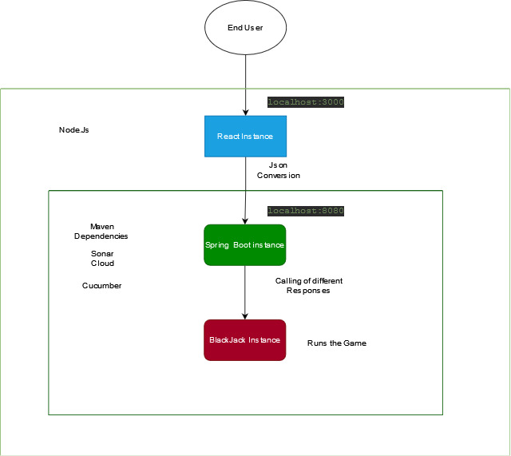
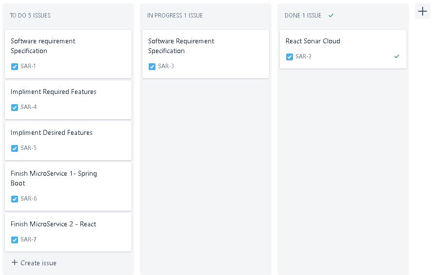
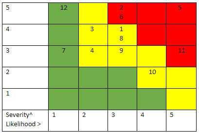

# BlackJackAppSpringBoot

Authors: Arkaan Quanunga, Sam King

## Summary

This project focuses on creating a web application of Black Jack using Spring boot. React is used for the presentation layer of this project.The project uses 8 decks and shuffles them at the start of the game.  

## Content
* [Intro](#BlackJackAppSpringBoot)
* [Architecture](#Architecture)
    * [Micro Service Architecture](#Micro-Service-Architecture)
    * [React Service](#React-Service-Setup)
    * [Spring Boot Service](#Spring-Boot-Service-Setup)
* [Development Environment](#Development-Environment)
    * [Architecture](#Development-Architecture)
    * [Kanban Board](#Kanban-Board)
    * [React Server Setup](#React-Server-Setup)
    * [Spring Boot Server Setup](#Spring-Boot-Server-Setup)

    

## Architecture

### Micro Service Architecture

### React Service Setup
1. Go to command line of Windows
2. Type the following command:

`   npm create-react-app BlackjackAppReact
`

This creates the standard React Service named BlackjackAppReact

3. Change directory to BlackjackAppReact in command line
4. Type the following command:
   `   npm install
   `
  This will install all the required dependencies for the project.

### Spring Boot Service Setup

1. Go to https://start.spring.io/
2. Name the Artifact and give it a suitable name
3. Generate the Folder
4. Open the folder in IntelliJ and add the dependencies from maven repository stated in [Tools](#Tools)
5. Build the Project and start working on the classes for BlackJack
## Development Environment

### Development Architecture

### Kanban Board
Jira is being used for Kanban Board to visualise the work to be done: 

### React Server Setup

   1. Open command prompt 
   2. Navigate to the project folder
   3. Run the following code:
  
     npm start
     
This should run the server for React App getting accessed by localhost:3000     
### Spring Boot Server Setup

   1. Open command prompt 
   2. Navigate to the project folder 
   3. Run the following code:
    
     mvn spring-boot: run 

This should run the server for Spring Boot getting accessed by localhost:8080 

     
## Tools
* Windows 10 as operating System 
* Microsoft Office Suite for Documentation
* Java 16 for programming the back-end application. 
* Jira – Kanban Board of choice 
* IntelliJ IDEA 2021.1 Community Edition by JetBrains for IDE 
* Sonar Cloud for checking code smells, security vulnerabilities, and bugs. 
* SpringBoot for back-end development 
* React for front-end development 
* Git 2.33 by Linus Torvalds for version control 
* Git Hub for cloud-based hosting service, managing Git Repositories 
* Apache Maven 3.8.1 based on a project object model (POM) 
* Junit 5.8 testing framework for writing unit tests – Dependency 
* Jacoco 0.8.7 for measuring code coverage in a codebase through visual reports 
* IO. Cucumber JUnit 6.11.0 for Feature Testing and Use Case Testing - Dependency 
* Cucumber for Java 212.4746.52 - Plug-In. IntelliJ. 
* Selenium 3.141.59 for testing web application- Integration Testing for both Microservices. 
* Jenkins - Open-source CI/CD pipeline builder. Very flexible in its implementation. 

## Continuous Integration 

## Risk Assessment
SWOT Analysis:

Risk assessment:
1) Eye strain
2) Posture issues/ Back strain
3) Too focussed on development rather than testing
4) Poor time management
5) Plugin issues
6) Missing deadlines
7) Scope Creep
8) Unclear Requirements
9) Poor communication
10) Working from home distraction
11) Lack of training with given software
12) Hardware breaking down 

